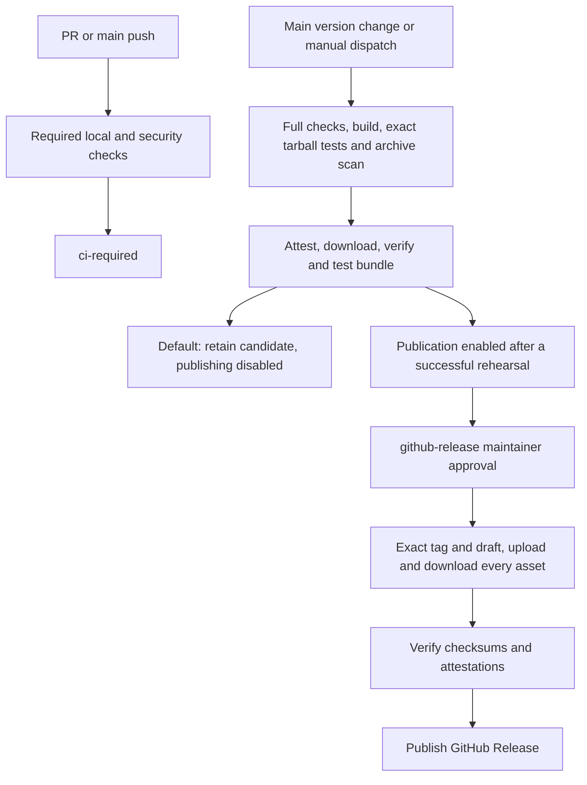

# GitHub CI/CD and release operations

GitHub Actions validates the source. GitHub Releases is the only distribution
channel for Cardano on EVM releases. npm installs dependencies, runs tools and
creates tarballs; all six project packages are private to prevent accidental
registry publication. Service hosting and blockchain deployments remain with
operators. A release workflow must never load wallet, submitter or executor keys.

The coordinated release version comes from `package.json`, the six package
manifests, the root lockfile and `versions.json`. Only reports bound to the
current source inventory and workflow run can satisfy a release gate.
See [implementation status](ci-cd-implementation-status.md) for actual checks and
open blockers; this guide describes operation, not proof of configured settings.

The initial workflow state is **CI enabled, version automation disabled, release
publication disabled**. Main version changes and manual release dispatches create
candidate-only attempts. Every attempt requires fresh all-severity audits of all three dependency trees;
the [runtime remediation](dependency-review.md) keeps the exception list empty.



## Repository setup requiring an operator

A repository import starts with the reviewed source archive and exact source
inventory from a fresh [clean-source acceptance run](acceptance.md). Its core
report records the archive checksum and source inventory. Local validation does
not create a commit, remote, protection setting or hosted check. Import the
inventoried files through an ordinary Git add and normal review.
Do not use a disposable test fixture commit as a release commit. Supply the actual
owner/repository when running the operator commands below. The intended initial
repository name is `cardano-on-evm`; replace `OWNER/REPO` with
`OWNER/cardano-on-evm` for that repository.

A practical bootstrap order is:

1. Review the source handoff and import only the inventoried source into a new
   writable checkout. Select the actual owner/repository and maintainers. Use a
   public repository for public distribution, or verify that the private plan
   provides all required CodeQL, attestation and environment-review features.
2. Create the repository with `main` as its default branch and push the reviewed
   initial commit. The first import runs ordinary CI; it does not publish or
   automatically prepare the existing version for release.
3. Configure and inspect the protections below, `github-release`, `version-pr`
   and the repository-scoped App. Keep both enablement variables false. Recheck
   the hosted audit results against the reviewed lockfiles.
4. Confirm normal and fork PR checks, CodeQL blocking and the emitted
   `ci-required` context. Dispatch the complete candidate-only workflow and
   review downloaded assets, attestations and the isolated consumer report.
5. Record that successful run/attempt, enable publication, and dispatch recovery
   for the exact reviewed candidate while it is fresh. Approve its immutable
   identity in `github-release`. A new candidate requires a new review/approval.

Example commands for the operator's **new import checkout**, after source review
and normal Git/GitHub authentication setup (these have not been executed here):

```sh
git init --initial-branch=main
git add .
git commit -m "Import reviewed Cardano on EVM source and CI/CD"
gh repo create OWNER/REPO --public --source=. --remote=origin --push
gh variable set RELEASE_PUBLISH_ENABLED --repo OWNER/REPO --body false
gh variable set VERSION_PR_ENABLED --repo OWNER/REPO --body false
```

Use an empty destination repository; this is not a command to replace existing
history. Importing the reviewed source bundle avoids copying this workspace's
dependencies, generated local artifacts or operator files. Configure server-side
protections immediately after the initial import and use reviewed PRs thereafter.

Configure and then inspect these server-side settings:

| Setting | Required configuration and evidence |
| --- | --- |
| Main branch | Active branch protection/ruleset for `main`; reviewed PRs, required `ci-required` from GitHub Actions, up-to-date checks, blocked force pushes/deletion. Confirm the check name from a real PR run. |
| Code scanning | Enable advanced CodeQL scanning for JavaScript/TypeScript, Python and Actions. In the active main ruleset require CodeQL results and security alerts **High or higher**. Disable conflicting default setup if GitHub requests that for advanced setup. |
| Maintainer ownership | Assign actual maintainers to workflow, CI/security, release tooling, package metadata and exception reviews. `CODEOWNERS` assigns @pmcorcoran; require the corresponding review and verify that this account has repository access. |
| Release tags | Protect `v*` from update/deletion and force pushes. Keep creation possible for the approval-gated workflow token; confirm any creation restriction's authorized actor in a real candidate rehearsal. A broad bypass must not grant ordinary PR jobs release authority. |
| Release environment | Create `github-release` with at least one actual maintainer reviewer, disable administrator bypass, and select a **branch** deployment rule exactly `main` with no tag rule. A YAML environment name alone does not configure this. |
| Dependency monitoring | Enable the dependency graph, Dependabot alerts and security updates; verify version-update PRs from `.github/dependabot.yml` for all three npm trees, browser requirements and Actions. Review coordinated bundler updates together. |
| Secret scanning | Inspect Secret Protection/secret-scanning alerts and enable repository push protection. Assign alert review, inspect bypass permissions, and verify settings with a harmless supported test secret in a disposable test repository. Local Gitleaks does not configure GitHub. |
| Private reporting | Enable private vulnerability reporting and verify the **Report a vulnerability** entry under Security → Advisories. The reporting instructions are in `SECURITY.md`; no project email has been selected. |
| Actions policy | Default workflow token read-only; enable the pinned actions used by the workflows. Fork PRs get no repository/App/release secrets and no write token. Keep normal fork-run approval policy. |
| Artifact retention | Repository/organization retention must permit 90 days. Ordinary CI uploads request 14 days; candidate uploads request 90 days. |
| Versioning App | Install a repository-scoped GitHub App with only the repository content and pull-request permissions needed by the versioning job. Its token creates the version PR so normal CI runs. Credentials belong only in that job's configured secrets. |
| Publication enablement | Keep publication disabled until one complete candidate-only GitHub run and the repository protection/settings checks have succeeded. Enabling publication does not replace environment approval. |

The environment's branch selection is matched against the workflow run's
`GITHUB_REF`. Required reviewers and other protection features depend on
repository visibility and plan; check their availability for the actual
repository. [GitHub environment documentation](https://docs.github.com/en/actions/reference/workflows-and-actions/deployments-and-environments).


The repository name, first push, and hosted settings are **future operator work**.
No local report proves these settings exist. Record evidence of the first successful
PR/fork-PR runs, `ci-required` enforcement, owner review, CodeQL merge blocking,
Dependabot operation, secret scanning, push protection, and private reporting
before treating hosted setup as complete. Retain the current local source
inventory/checksums when importing; rerun checks if the imported bytes differ.

Official setup references: [Dependabot](https://docs.github.com/en/code-security/tutorials/secure-your-dependencies/dependabot-quickstart),
[secret scanning](https://docs.github.com/en/code-security/how-tos/secure-your-secrets/detect-secret-leaks/enable-secret-scanning),
[push protection](https://docs.github.com/en/code-security/how-tos/secure-your-secrets/prevent-future-leaks/enable-push-protection),
and [private vulnerability reporting](https://docs.github.com/en/code-security/how-tos/report-and-fix-vulnerabilities/configure-vulnerability-reporting/configure-for-a-repository).

CodeQL SARIF upload alone does not configure merge protection. The local SARIF
gate blocks high/critical findings, while the repository ruleset must require
CodeQL results at the chosen threshold. [GitHub code scanning merge protection](https://docs.github.com/en/code-security/how-tos/find-and-fix-code-vulnerabilities/manage-your-configuration/set-merge-protection).

Tag update/deletion rules and their bypass actors are independent of a workflow
file. Inspect the actual rules before enabling publication. [GitHub ruleset rules](https://docs.github.com/en/repositories/configuring-branches-and-merges-in-your-repository/managing-rulesets/available-rules-for-rulesets).

Read-only inspection with an already authorized GitHub CLI session:

```sh
gh api repos/OWNER/REPO/branches/main/protection
gh api repos/OWNER/REPO/rulesets --paginate
gh api repos/OWNER/REPO/environments/github-release
gh api repos/OWNER/REPO/environments/github-release/deployment-branch-policies
gh api repos/OWNER/REPO/actions/permissions/workflow
gh api repos/OWNER/REPO/actions/permissions
gh variable list --repo OWNER/REPO
gh secret list --repo OWNER/REPO
```

Inspect each returned ruleset's details and inherited organization rules as
well. `404`/`403`, an empty response, or YAML declarations are not successful
verification of a setting. Record the repository, timestamp and sanitized
settings responses with the first candidate's operator evidence. Secret listing
returns names; never put secret values in reports or issue comments.

## Source checkout installation

Use the version/tag/commit you intend to inspect. Local release builds target
Node **26.8.1**, npm **11.19.0**, Solc **0.8.30**, Python **3.13**, Playwright
**1.62.0** and Foundry/Anvil **1.8.1**. Fast compatibility lanes also test Node
**22.18.0** and current **24 LTS**. Compiler optimizer/viaIR/EVM/metadata settings
and the deployed creation-bytecode pins remain enforced by the existing build.

```sh
npm ci --ignore-scripts
npm run check:repository
npm run version:check
npm run build:contracts
npm run build
npm test
npm run check:types
npm run check:vendor
npm run test:ci
```

Core installation does not install the private bundler. That optional service
has independent locks at `infra/bundler/package-lock.json` and
`infra/bundler/build-tools/package-lock.json`; retain both separate installs.
Its basic local execution, generated strict-parser regression and preferred-source
build are separate evidence categories; none implies full strict public execution.

## Local validation and evidence

Install hash-locked browser dependencies in a Python 3.13 virtual environment,
then install Chromium and the pinned Foundry archive. Use the actual virtual
environment's Python for both Playwright and the browser harness:

```sh
python3.13 -m venv .local/ci-venv
.local/ci-venv/bin/python -m pip install --require-hashes -r tests/browser/requirements.txt
.local/ci-venv/bin/python -m playwright install --with-deps chromium
node scripts/install-foundry.mjs
```

Choose a new output directory for each run. Contexts and suite reports cannot be
silently overwritten. `VALIDATION_PYTHON` tells the outer evidence wrapper which
interpreter supplies Playwright; the harness receives that interpreter with
`--python`. Outputs remain isolated from source and operator inputs.

```sh
python3 scripts/ci/evidence.py init --mode local --out .local/ci-run
VALIDATION_PYTHON=.local/ci-venv/bin/python python3 scripts/ci/evidence.py run \
  --context .local/ci-run/context.json --suite core --out .local/ci-run \
  --include core -- python3 scripts/check-clean-source.py \
  --out .local/ci-run/core --python .local/ci-venv/bin/python
python3 scripts/ci/evidence.py run --context .local/ci-run/context.json \
  --suite bundler --out .local/ci-run --include bundler -- \
  python3 scripts/ci/run-bundler.py --out .local/ci-run/bundler
python3 scripts/ci/evidence.py verify --context .local/ci-run/context.json \
  --reports .local/ci-run/reports --suites core bundler
```

The core harness exports source through ordinary Git add and checkout-index in
a disposable repository, verifies hashes/executable bits, and runs local deployment,
SDK, permanent policy, cryptographic corpus, package-consumer, HTTP and browser
tests, and cleans up its services. Its read-only reference RPC fixture accepts
only planned methods and parameters and has no public fallback. Transaction
execution uses a separate Anvil process. Dependency downloads may still require
network access; public blockchain RPC is not a prerequisite for local tests.

The inventory implementation is `scripts/ci/evidence.py`: sorted relative POSIX
path, SHA-256 and executable bit, encoded as compact sorted-key JSON without a
trailing newline, then hashed using SHA-256. It includes source, lockfiles,
generated public test fixtures, vendored inputs, workflow/configuration and docs. It excludes generated outputs/dependencies/caches/current-run reports,
generated contract package files, generated license inventories and operator
secrets. Included symlinks/special files are rejected. Inventory bytes, commit,
repository, workflow run/attempt, a fresh context nonce, toolchain, command exit
codes and all included evidence hashes bind each report to one run.

Local contexts are visibly ineligible for release, even when all local suites
pass. Candidate contexts require a real clean commit and a main GitHub run.
Candidate evidence expires for publication after 24 hours; revalidation creates
a new candidate that needs fresh approval. Read-only verification of an already
published release continues to validate its immutable bytes and identities after
that window. `package-release.py verify --for-publication` enforces freshness for
approval/publication/recovery; its ordinary `verify` command checks downloaded
historical release integrity without claiming fresh approval. Copies of historical or another run's JSON files
cannot satisfy the gate. CI artifacts retain command logs, validation reports
and browser failure images even when the command fails.

## Coordinated version changes

Record an intentional public change using `npm run changeset`. Changesets is
used only for version calculation, changelogs, internal dependency updates and
preparing a reviewable version PR. `npm run version:check` verifies the six
versions plus root metadata/lockfile. `npm run version:apply` applies pending
changesets and synchronizes the root metadata. Run it in a clean writable
checkout; the automated workflow creates a PR for maintainer review.

Do not run Changesets publish, `npm publish`, or GitHub Packages publication.
The six packages' `private: true` metadata does not prevent `npm pack` or local
tarball installation. Tests use a disposable alternate version fixture; that
fixture is not a requested release bump.

## Security and monitoring

The security lane audits all three actual npm trees, captures npm SBOM and
license inventory inputs, runs Gitleaks, and gates CodeQL SARIF for all three
supported languages. Gitleaks and actionlint binaries are checksum-pinned;
workflow actions are pinned to full commit SHAs. Dependabot opens weekly updates
for all three lockfiles, the browser requirements and Actions. Those PRs run the
normal required checks.

An exception is a specific reviewed advisory/dependency/version/severity with
rationale, real owner, approval date and an expiry at most 30 days later.
Malformed/expired records, increased severity and new unapproved findings fail
the policy. Never renew an exception automatically, widen its version range or
invent an owner to obtain green CI. Existing bundler risk discussion is in
[dependency review](dependency-review.md); that prose is not a dated risk approval.
The exception list is empty. The initial runtime findings were remediated through
a coordinated dependency migration and behavioral revalidation. New findings
still block the all-severity gate; exposure notes do not waive them.

The machine-readable file is `security/dependency-exceptions.json`, with
`schema_version: 1` and an `exceptions` array. Each approved record must contain
exactly these fields; the validator does not accept wildcard package versions:

| Field | Value to obtain from the review |
| --- | --- |
| `tree` | `.`, `infra/bundler`, or `infra/bundler/build-tools` |
| `advisory` | Exact GitHub advisory ID, `GHSA-…` |
| `dependency`, `version` | Actual vulnerable dependency and one exact locked version |
| `severity` | Accepted advisory severity: `info`, `low`, `moderate`, `high`, or `critical` |
| `rationale` | Specific exposure, boundaries, and reason for accepting it temporarily |
| `owner` | The actual approving maintainer's `@user` or `@organization/team` |
| `approved_at`, `expires_at` | UTC `YYYY-MM-DD`; expiry is exclusive and at most 30 days after approval |

Review the current records with `python3 scripts/ci/security.py audit --out
.local/security-review`. Any nonzero result blocks acceptance and must be investigated; a registry or
audit-tool failure is not a clean scan. Approve exception changes through an owned PR;
the code validator can check syntax and dates but cannot invent or establish a
maintainer's authority. Any renewal requires a new explicit review.

Watch the Actions checks and GitHub security dashboard after PRs, main merges,
nightly scans and dependency updates. Record the affected advisory, exact locked
version and remaining exception lifetime when triaging. A failed audit command
or unusable audit/SARIF JSON fails the lane; report upload cannot turn it green.
The nightly/manual **Network compatibility** check is read-only Base Sepolia
preflight. Triage its RPC/provider/deployment errors separately from deterministic
local acceptance; it is not a `ci-required` or candidate prerequisite.

## First-release acceptance evidence still required

Before enabling publication, preserve a successful complete candidate-only
GitHub run, actual fork PR CI, server-side protection/settings evidence, and
source/library assets downloaded from GitHub with verified checksums and
attestations. Re-run the bundled isolated consumer against those downloaded
tarballs. It must resolve every `@cardano-on-evm` sibling from the local bundle,
test ESM exports and declarations, and show Alto is absent. Local archives and
mocked publication responses do not prove any of these remote checks.

Publication requires the `github-release` environment approval for a particular
commit and SHA256SUMS digest. Approval must happen before tag/draft creation.
After approval the job uses the already reviewed bytes. It uploads to a draft,
downloads the assets again, checks hashes and attestations, and publishes only
after verification. An interrupted/conflicting/failed upload remains unpublished.
Correct a faulty published release with a new version; preserve previous tags
and assets.

GitHub CLI attestation verification supports repository, signer workflow, source
digest/ref and signer digest restrictions. Use the exact expected identity;
merely accepting an attestation from any repository/workflow is insufficient.
[GitHub CLI verification reference](https://cli.github.com/manual/gh_attestation_verify).

## Release workflow bootstrap and operation

There is no GitHub repository yet. These are operator actions for the future
repository, not settings or runs verified in this workspace. Import the reviewed
source into a real writable checkout, commit it, and create the intended GitHub
repository. A public repository is the straightforward GitHub-only distribution
choice; if choosing private visibility, first verify that the account plan
supports all required CodeQL, artifact attestation and environment-review
features. Do not weaken the required gates to fit an incompatible plan.

The default state is practical and closed to publication: normal CI runs on
every PR/main push; nightly security and independent read-only Base Sepolia
checks run; version-change pushes create a complete candidate only; manual
dispatch also defaults to candidate-only. The initial import does not implicitly
release the current version. Version PR automation remains disabled until its
App environment is configured. Any new unapproved dependency finding blocks
candidate assembly. Rerun all three audits and remediate findings before
expecting a candidate-only run to pass; the current exception list is empty.

Configure the branch/tag/CodeQL/ownership/retention settings documented above.
Then configure these exact values in Settings → Secrets and variables → Actions:

| Name | Location and initial value |
| --- | --- |
| `RELEASE_PUBLISH_ENABLED` | Repository variable, `false`; absence also disables publication. |
| `RELEASE_REHEARSAL_RUN_ID` | Repository variable, unset until a complete candidate-only GitHub run succeeds. |
| `RELEASE_REHEARSAL_RUN_ATTEMPT` | Repository variable, the actual successful rehearsal attempt; normally `1`. |
| `VERSION_PR_ENABLED` | Repository variable, `false` until App setup is verified, then `true`. |
| `VERSION_APP_ID` | Repository variable containing the actual installed GitHub App's numeric App ID. |
| `VERSION_APP_PRIVATE_KEY` | **Environment secret in `version-pr`**, containing the App private key. Do not duplicate it as a repository/organization secret. |

Create `version-pr` with a selected **branch** deployment policy exactly `main`.
Its environment secret is referenced only by the `version` job in `version.yml`.
It does not require a reviewer gate; its purpose is to confine the App credential
to the trusted main versioning job. Create/install a GitHub App on **only this
repository**, with repository **Contents: read/write**, **Pull requests:
read/write**, and the mandatory read-only metadata permission. It needs no
organization, administration, Actions, Packages, workflow-write or registry
permission. The pinned `actions/create-github-app-token` call further scopes the
installation token to the current owner/repository and those two write
permissions, and revokes it at job end. Normal PR CI receives none of these
credentials. No npm token or wallet/deployment key is required anywhere.

Create `github-release` with at least one real maintainer as required reviewer,
disable administrator bypass, and select a **branch**
deployment rule exactly `main` with no tag rule. The approval job shows the run
summary containing the immutable commit, version, Actions artifact ID, artifact
ZIP digest, candidate `SHA256SUMS` digest and handoff digest. All building,
packing, secret scanning, exact-tarball installation and attestation generation
happen before this job can start. A YAML environment name is not evidence that
the server has these protections. Enable prevent-self-review only if another
maintainer can approve manually dispatched runs; one required maintainer approval
is the release requirement.

After the initial normal PR and main checks are observable, set main's required
check to the actual emitted **`ci-required`** context from GitHub Actions and
verify a fork PR can run without App/release secrets. Verify the configured
CodeQL merge protection with a controlled finding on a test branch; merely
uploading SARIF is insufficient. Inspect the exact protected `v*` tag rules:
permit the approval-gated workflow to create a new tag, block update/deletion,
and do not give ordinary PR jobs a broad bypass. Check organization rules as
well. These are still outstanding real GitHub acceptance checks.

Read-only operator inspection (replace `OWNER/REPO`; do not print secrets):

```sh
gh api repos/OWNER/REPO/environments/version-pr
gh api repos/OWNER/REPO/environments/version-pr/deployment-branch-policies
gh secret list --repo OWNER/REPO --env version-pr
gh variable list --repo OWNER/REPO
gh api repos/OWNER/REPO/environments/github-release
gh api repos/OWNER/REPO/environments/github-release/deployment-branch-policies
gh api repos/OWNER/REPO/actions/permissions/workflow
gh api repos/OWNER/REPO/rulesets --paginate
```

The workflows use Ubuntu 24.04 GitHub-hosted runners. New release builds use
Node 26.8.1/npm 11.19.0, Python 3.13, the hash-locked Playwright requirements,
Anvil/Forge 1.8.1 and the unchanged Solc 0.8.30 build settings/pins. No ordinary
dependency/build cache is restored by candidate jobs. The workflow token is
read-only by default. Only the publication job has `contents: write`; only the
attestation job has `id-token: write` and `attestations: write`. The called CI
grants CodeQL `security-events: write`/`packages: read`, never package-publishing
permission. GitHub CLI must support all of the attestation identity flags below;
unsupported flags stop verification rather than relaxing it.

## Complete first candidate without a tag or release

Once dependencies/security and operator settings are ready, dispatch on main:

```sh
gh workflow run release.yml --repo OWNER/REPO --ref main -f mode=candidate-only
gh run list --repo OWNER/REPO --workflow release.yml --limit 10
gh run watch RUN_ID --repo OWNER/REPO --exit-status
gh run view RUN_ID --repo OWNER/REPO --json headSha,conclusion,jobs,url
gh run download RUN_ID --repo OWNER/REPO --name release-candidate-RUN_ID-ATTEMPT --dir .local/downloaded-candidate
gh run download RUN_ID --repo OWNER/REPO --name release-review-RUN_ID-ATTEMPT --dir .local/downloaded-review
```

New candidates use the immutable `GITHUB_SHA` snapshot from the main push or
dispatch. The workflow checks that `GITHUB_WORKFLOW_SHA` is the same commit so
GitHub OIDC provenance certifies that exact source and signer digest. It does
not accept an arbitrary historical source SHA under a newer workflow
certificate. A later main commit cannot replace the captured SHA. On push,
version detection compares the complete `github.event.before..github.sha`
range, including multi-commit pushes; the all-zero initial-import base requires
manual first-candidate dispatch. A non-version main change does not assemble a
candidate.

The final `release-candidate-RUN_ID-ATTEMPT` artifact has this layout:

```text
candidate.json                 # immutable handoff: run/attempt/commit/version/all asset hashes
provenance.sigstore.jsonl       # signed provenance for every final asset, including SHA256SUMS
assets/
  SHA256SUMS
  release-manifest.json
  context.json
  source-inventory.json
  cardano-on-evm-VERSION-source.tar.gz
  cardano-on-evm-VERSION-libraries.tar.gz
  cardano-on-evm-VERSION-contracts.tar.gz
  cardano-on-evm-VERSION-validation.tar.gz
  cardano-on-evm-VERSION-security.tar.gz
  ...three SBOMs, three license inventories, archive scan evidence...
```

`SHA256SUMS` hashes the final payloads and manifest, never itself; its SHA-256 is
the candidate ID. `candidate.json` separately binds the signed provenance
bundle's hash, avoiding a self-attestation/checksum cycle. The attestation
bundle stays outside `assets/` so adding it cannot alter the frozen payload.
Release uploads include every `assets/` file plus `provenance.sigstore.jsonl`.
Candidate Actions artifacts and their review/publication evidence request
90-day retention. Repository/organization settings must permit that retention.

The **Verify candidate for review** job downloads the exact artifact ID and
checks the actual ZIP SHA-256 against both GitHub's metadata and the producing
job output. It verifies all packaged evidence, hashes and attestations, then
extracts the verified library bundle and runs its own bundled isolated consumer
against all six downloaded `.tgz` files. The result is saved under the review
artifact's `downloaded-consumer/package-install.json`, with installation logs.
This job must pass before either environment approval or bootstrap proof is
accepted. Candidate-only mode skips the publication job entirely, creating no
tag or draft/public release.

An operator can independently verify downloaded assets using the reviewed
source checkout:

```sh
python3 scripts/package-release.py verify --out .local/downloaded-candidate/assets --context .local/downloaded-candidate/assets/context.json
gh attestation verify .local/downloaded-candidate/assets/SHA256SUMS --repo OWNER/REPO --bundle .local/downloaded-candidate/provenance.sigstore.jsonl --source-digest RELEASE_COMMIT --source-ref refs/heads/main --signer-workflow OWNER/REPO/.github/workflows/release.yml --signer-digest RELEASE_COMMIT --cert-identity https://github.com/OWNER/REPO/.github/workflows/release.yml@refs/heads/main --deny-self-hosted-runners
```

Repeat the attestation command for **every file** in `assets/`, not just the
checksum file. The workflow performs that complete loop automatically. Confirm
the manifest/source/library hashes, exact toolchain and current validation/audit
reports against the run summary. Extract the verified library archive into a
fresh directory and rerun:

```sh
node PATH_TO_EXTRACTED_BUNDLE/scripts/check-package-install.mjs --archives PATH_TO_EXTRACTED_BUNDLE/archives --out .local/operator-consumer
```

The consumer denies project-package registry requests, uses exact local sibling
tarballs, tests ESM exports/declarations and checks Alto is absent. It may
download ordinary third-party dependencies. The local verification command
without `--for-publication` supports historical downloaded releases; **every
workflow approval/publication/recovery gate uses `--for-publication`** and
rejects candidate evidence older than 24 hours.

## Enable and approve the first release

Preserve the successful candidate-only run ID/attempt and sanitized
server-side settings/fork CI evidence. Only after that review, set
`RELEASE_REHEARSAL_RUN_ID`, `RELEASE_REHEARSAL_RUN_ATTEMPT` and then
`RELEASE_PUBLISH_ENABLED=true`. This repository setting is an operator action,
not environment approval. The workflow independently reads the named prior
GitHub run/attempt, requires the exact `release.yml` path, main branch, trusted
event, overall success, successful review job and skipped publication job,
downloads its immutable artifact and verifies a `mode: candidate-only` handoff
and original attestations. A fabricated local run ID or an unrelated successful
workflow cannot satisfy the prerequisite. Keep that rehearsal artifact/run
available; before its 90-day artifact expires, record another successful
candidate-only rehearsal.

To approve the exact first candidate already reviewed, while it remains fresh:

```sh
gh workflow run release.yml --repo OWNER/REPO --ref main -f mode=recover -f recovery_run_id=RUN_ID -f recovery_run_attempt=ATTEMPT -f recovery_candidate_id=REVIEWED_SHA256SUMS_DIGEST
```

This recovery dispatch uses the original candidate's immutable asset ID and
digest, source commit, evidence and attestations; it does not rebuild or re-sign
them. It also verifies the original commit remains merged into the current main
snapshot. If the candidate has expired, dispatch `-f mode=publish` on main to
create and review a fresh complete candidate, then approve that new identity.
Once enablement is true, subsequent main version changes request publication
automatically, still behind the same environment gate. Maintainers should
approve only the commit/version/candidate/artifact digests shown in the new run
summary. Approval is required before tag creation and draft creation.

The approved job downloads the exact reviewed artifact again, rechecks freshness
and attestations, creates `vX.Y.Z` at the reviewed commit using the workflow
token, then creates a draft using GitHub CLI. It uploads every required asset,
downloads all release assets again, verifies their hashes, complete packaged
evidence and expected GitHub attestations, checks that the tag/release/asset
identities did not change during verification, and only then publishes. It does
not execute downloaded library code with the publication token. Publication is
serialized with `cancel-in-progress: false`.

## Failed-upload recovery

Inspect a failed run and the draft before retrying. Interrupted or failed uploads
remain unpublished. Reuse `mode=recover` with the **original candidate-producing
run/attempt** and reviewed candidate digest; a recovery run itself has no new
candidate artifact. The original review job must have completed successfully.
Freshness still applies and the recovery dispatch still requires a new
`github-release` approval. Do not use a partial CI rerun to mix evidence from
different attempts; use a fresh full candidate dispatch when prepublication
validation failed.

Safe recovery permits an existing `vX.Y.Z` only at the exact original commit and
an existing draft only with the same candidate/provenance marker and identical
existing asset hashes. It downloads existing bytes before deciding to reuse
them, uploads only missing files, and never uses `--clobber`, tag force updates
or silent asset deletion. Conflicting tag targets, hashes, extra/duplicate
assets, mismatched candidate markers, incomplete published releases, and
GitHub API/attestation/download failures stop the workflow. An interrupted
GitHub `starter` asset needs explicit operator inspection/removal of that
unfinished draft upload; automation does not delete it. Correct a published
faulty release with a new coordinated version, preserving prior tags/assets.

If a stale draft already exists, a newly built candidate of the same version
will have different evidence bytes and must not overwrite that draft. Review
and explicitly retire only the unpublished draft/tag through the operator's
authorized process, or prepare a new coordinated version. This implementation
does not automate destructive cleanup. Matching already-published bytes can be
verified idempotently without any mutation.

Local controlled response/ZIP tests cover interrupted uploads, same-byte retry,
conflicts, stale publication-gate propagation, tampered artifacts, failed
attestations and bootstrap/recovery identity checks. They are not GitHub
approval, upload or attestation acceptance evidence. No GitHub repository, App,
environment, tag, release, approval or deployment was created here.

Official behavior checked for this implementation: [artifact upload inputs and
digest outputs](https://github.com/actions/upload-artifact/blob/ea165f8d65b6e75b540449e92b4886f43607fa02/action.yml),
[GitHub App token permissions/revocation](https://github.com/actions/create-github-app-token/blob/fee1f7d63c2ff003460e3d139729b119787bc349/action.yml),
[attestation subject/bundle inputs](https://github.com/actions/attest-build-provenance/blob/977bb373ede98d70efdf65b84cb5f73e068dcc2a/action.yml),
[GitHub CLI attestation identity restrictions](https://cli.github.com/manual/gh_attestation_verify),
[workflow environment identity](https://docs.github.com/en/actions/reference/workflows-and-actions/variables),
and [App events triggering ordinary workflows](https://docs.github.com/en/actions/how-tos/write-workflows/choose-when-workflows-run/trigger-a-workflow).
